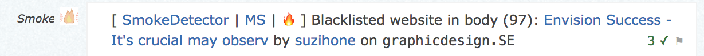

# 🔥 FIRE!&nbsp;&nbsp;&nbsp;&nbsp;([Code](https://github.com/Charcoal-SE/userscripts/blob/master/fire/fire.user.js)) &nbsp;([Install](https://github.com/Charcoal-SE/userscripts/raw/master/fire/fire.user.js))

Feedback Instantly, Effortlessly, and Rapidly (FIRE)
is a userscript which allows you to react to SmokeDetector spam reports in chat
without leaving the chat room.

This is still a "work in progress".

As of this moment, the userscript posts flags _and_ MS feedback.

---

## Features
- Open a popup for any SmokeDetector report by clicking the "Fire" or "🔥" button in the report.
  
- SmokeDetector's _last_ report can be opened in a popup using <kbd>Ctrl</kbd>+<kbd>Space</kbd>
- The popup will contain:
  - A header for the post's site
    - Clicking this header or pressing <kbd>7</kbd> will open the reported post on the site.
  - A "Close" button.
  - 6 feedback buttons.
    - `[spam]`, `[rude]`, `[tpu-]`, `[tp-]`, `[naa-]`, `[fp-]`, for spam (with flag), rude/abusive (with flag), tpu- feedback without flag, vandalism, NAA/VLQ, false positive.
    - These can be selected with <kbd>1</kbd> through <kbd>6</kbd>, then "clicked" by pressing <kbd>Space</kbd> or <kbd>Enter</kbd>.
    - The buttons can contain a number in parentheses. This indicates how many users have sent that type of feedback. All of `[spam]`, `[rude]`, and `[tpu-]` are the same feedback and will show the same number. They differ in what flag was raised, if any, but flag counts are not displayed.
  - The title for the reported question, or the title of the question on which the reported answer was placed.
    - Hovering over the title will display why the post was reported.
    - To the left of the title:
      - A ✏️ is displayed if the post has more than one revision (i.e. it has been edited, but not including edits made during the edit grace period).
<!--      - A 🏳️ is displayed if you have manually flagged the post.-->
<!--      - A 🏴 is displayed if you have auto-flagged the post.-->
  - The username of the post author and their reputation on that site.
  - The reported post's contents.
    - All links in a post will show a tooltip with their target URL when you hover your mouse over them. This is in addition to the browser's default display of hovered URLs.
    - Code blocks in the post can be expanded by clicking on them.
    - If selected (configurable setting), the post's images are hidden behind a placeholder image that can be clicked to show the image included in the post. If this option is set, then the post's images are not downloaded from their source until you click on the placeholder. This is to prevent potentially NSFW images from being downloaded to your machine.
  - At the bottom right of the popup, is a ⚙️, which opens the settings popup when clicked.
  - Just to the left of the ⚙️ is the currently running version number of FIRE. It's a link to download the most recent released version from GitHub.
- Provided you [have authorized metasmoke](https://metasmoke.erwaysoftware.com/authentication/status) to cast flags from your account _and_ the configuration setting for flagging is enabled:
  - When you submit `spam` feedback, the post will _also_ be flagged as "spam" on the SE network.
  - When you submit `rude` feedback, the post will _also_ be flagged as "rude/abusive" on the SE network.
  - Those buttons will still work for providing feedback when the configureation setting for flagging is disabled.
- The popup modal's blur can be toggled with <kbd>B</kbd>
- The popup can be closed by pressing <kbd>Esc</kbd>, clicking outside of the popup, or clicking the `[Close]` button at the top-right of the popup.

### Examples

When SmokeDetector reports a post, these steps can be taken:

To flag it as spam and send _"True positive"_ feedback (_tpu-_):

1. <kbd>Ctrl</kbd>+<kbd>Space</kbd> - Open the last report,
2. <kbd>1</kbd> - Select _"spam"_,
3. <kbd>Space</kbd> or <kbd>Enter</kbd> - Submit.

To send _"False positive"_ feedback:

1. <kbd>Ctrl</kbd>+<kbd>Space</kbd> - Open the last report,
2. <kbd>6</kbd> - Select _"fp-"_ (False positive),
3. <kbd>Space</kbd> or <kbd>Enter</kbd> - Submit.

To open the reported post on its site:

1. <kbd>Ctrl</kbd>+<kbd>Space</kbd> - Open the last report,
2. <kbd>7</kbd> - Open the post.

## Authorize FIRE with Stack Exchange

1. Open the settings window.
2. Click "Authorize" button.
3. A new window opens where you "accept"
4. That window redirects to this chat with an access token in the URL hash.
5. Fire sees the hash, saves your token, then closes the new window.
6. You go back to the old window, it detects a token, and shows you a "success" message.

You will need to do this from chat.stackexchange.com (chat.SE), commonly from [Charcoal HQ](https://chat.stackexchange.com/rooms/11540/charcoal-hq).
Once you have chat.SE configured as you desire, you can manually transfer that configuration, including the tokens for authorizing with
Stack Exchange and metasmoke by:
1. In Charcoal HQ, enter the following into the browser console for the tab:

       (function(){var userData = localStorage['fire-user-data']; console.log(`(function(){localStorage['fire-user-data'] = '${userData}';})()`);})()
2. Copy the entirety of the output from that command and paste it into the browser console for a tab in chat.stackoverflow.com (chat.SO)
(e.g. [SOCVR](https://chat.stackoverflow.com/rooms/41570/so-close-vote-reviewers)). Then reload all tabs on chat.SO that are using FIRE.
This will overwrite the FIRE settings on chat.SO with the FIRE settings on chat.SE. If you also paste the same console output into a tab on
chat.meta.stackexchange.com, you'll have the same FIRE settings on all three chat servers.

## Loading from a bookmarklet (e.g. on mobile)

It is possible to load FIRE and AIM into the page using a bookmarklet. You can use the following code to load both
FIRE and AIM into a chat page using a bookmarklet or just by running the following in the browser console:

    javascript:void(function(){
      $.getScript( 'https://cdn.jsdelivr.net/gh/joewalnes/reconnecting-websocket@5c66a7b0e436815c25b79c5579c6be16a6fd76d2/reconnecting-websocket.js' )
        .then(() => $.getScript( 'https://charcoal-se.org/userscripts/vendor/debug.min.js' ))
        .then(() => $.getScript( 'https://cdn.jsdelivr.net/gh/Charcoal-SE/Userscripts/autoflagging/autoflagging.user.js'))
        .then(() => {
          window.GM_info = {
            script: {
              version: '5.0.20',
              downloadURL: 'https://raw.githubusercontent.com/Charcoal-SE/Userscripts/master/fire/fire.user.js',
            },
          };
          $.getScript( 'https://cdn.jsdelivr.net/gh/Charcoal-SE/Userscripts/fire/fire.user.js' );
        });
    })();

## Common Failures

 - When you first install FIRE, you probably have to reload the chat room before you see the clickable 🔥 FIRE decorations
 - Forgetting to authorize FIRE. See the previous section.
 - FIRE will not submit flags on any site where you are a diamond moderator (♦), as a security precaution. However, it will still flag on all other sites. Your feedback will still be submitted on sites you are a moderator. The restriction of not raising flags on sites where you are a moderator is a general flagging-through-metasmoke restriction.  
 - Flagging will fail if you are not registered on the particular site.

## Version History

|1.4    ||
| ---   |---
|1.4.1  |Bugfixes: Be sure to turn off FIRE button loading indicator; UI glitch in FIRE settings button preventing click
|1.4.0  |<ul><li>Have links in reports wrap anywhere</li><li>Don't allow the report cache to grow without bound</li><li>Fix the blur option so it doesn't cause the chat page to relayout</li><li>Allow the main and settings popups to be moved and resized.</li><li>Linkify some URLs in the why data</li><li>Use a more identifiable name for the fireChatListener</li><li>Always allow re-authorization with SE</li><li>Add room 129590</li><li>Due to HTTPS certificate issues change to via.placeholder.com</li><li>Spin the FIRE button when loading to indicate progress</li><li>Linkify the URLs in the blacklisted user reason.</li><li>Allow some tooltips (e.g. the why data) to lock open upon click</li><li>Trigger events with post data when opening and closing, to allow better integration with add-ons.</li><li>Various internal improvements</li><li>Better responsiveness</li><li>Move the CSS into the main script, rather than an external file.</li><li>Handle backoffs from the SE API</li><li>Format the why data</li><li>Better linking of username</li><li>Handle SE site-relative URLs</li><li>Support spoilers, blockquotes, tables, snippets (somewhat), H4-H6, embedded YouTube videos in iframes</li><li>Prevent display of HTML elements which SE doesn't support.</li><li>More accurately  recover the original HTML from the SD processed report body.</li><li>Rewrite a considerable portion of generating the report body.</li><li>Adjust formatting of headers to more closely match SE presentation</li><li>xo 0.30.0 and eslint 6.8.0 changes</li><li>Formating and code style changes</li></ul>

|1.3    ||
| ---   |---
|1.3.0  |Add recognition of the new user, "metasmoke", posting "feedback received" messages. Update list of rooms in which FIRE runs.

|1.2    ||
| ---   |---
|1.2.0  |Add rude/abusive flagging. `@require` script dependencies. Adding R/A flagging changes keyboard shortcuts. Fix flagging toastr messages, which were often not displayed. A toastr message will now be displayed for each of feedback and flagging. The toastr for feedback will be on top.

|1.1    ||
| ---   |---
|1.1.0  |Enable FIRE on chat transcripts, searches and user pages. Add room 58631: The Restaurant at the End of the Universe. Adjust CSS (position for MS button, version and settings button;add/adjust blockquote, li, code). Add toast messages for other MS flagging responses (no account & already flagged).

|1.0    ||
| ---   |---
|1.0.32 |Bugfix: Escape image tags in code blocks
|1.0.31 |Remove display of weight. Adjust probably deleted detection when flagging via MS. Keypress block (again).
|1.0.30 |Prevent keypress from affecting chat input when the popup is open. Add chat rooms.
|1.0.29 |Update MS API filters due to MS changes.
|1.0.28 |Adapt to new SmokeDetector report URL format.
|1.0.27 |Added the ["The Fire Department"](https://chat.meta.stackexchange.com/rooms/1181/the-fire-department) room.
|1.0.26 |Bugfix: property escape `<link rel="stylesheet"`
|1.0.25 |Added cache breaker to update link.
|1.0.24 |Added FIRE icon to the userscript.
|1.0.23 |Added the ["The Awkward Silence"](https://chat.stackexchange.com/rooms/61165/the-awkward-silence) room.
|1.0.22 |SD API V2.0 bugfixed
|1.0.21 |SD API V2.0
|1.0.20 |Bugfix: FIRE crash on "SmokeDetector started" message.
|1.0.19 |Build Validation fix.
|1.0.18 |Bugfix: FireFox still has issues loading the current user.
|1.0.17 |Bugfix: Escape style tags in posts.
|1.0.16 |Bugfix: Escape script tags in posts.
|1.0.15 |Bugfix: Escape HTML in report titles.
|1.0.14 |Bugfix: Ignore case on whitelisted tags.
|1.0.13 |Fixing "Decorate existing messages" for FireFox
|1.0.12 |Reducing the max size of a rendered image.
|1.0.11 |Bugfix: `decorateExistingMessages` timing.
|1.0.10 |Bugfix: got incorrect post ID for reports where the url contains a number.
|1.0.9  |Add SoBotics room.
|1.0.8  |Log toastr messages to the console.
|1.0.7  |Show "loading" error notification if FIRE fails to load a MS report.
|1.0.6  |Fixing incorrect escaping of HTML: Whitelisted some tags.
|1.0.5  |Fixing incorrect escaping of HTML / code blocks. Adding user's rep.
|1.0.4  |Fix `left` positioning of the FIRE popup to be within the left boundary of the screen.
|1.0.3  |Fix edit icon appearing in post.
|1.0.2  |Properly escape HTML in inline code.
|1.0.1  |Prevent link highlight shadow from overlapping preceding lines.
|1.0.0  |Removed "markdown" option, made links more obvious.

|0.9    ||
| ---   |---
|0.9.28 |Option to show markdown instead of rendered post.
|0.9.27 |Bugfix: Don't show FIRE icon on !!/help messages.
|0.9.26 |EmojiOne's paths changed.
|0.9.25 |Bugfix: don't open image url when showing the original image.
|0.9.24 |Fire now hides images in reported posts, by default.
|0.9.23 |Added version to the popup footer, with update link.
|0.9.22 |Added support for keypad keys.
|0.9.21 |Added logic to mark a deleted post as deleted on metapi.
|0.9.20 |Added the "The Spam Blot" chatroom.
|0.9.19 |Compatibility: Add fire to the global scope, but don't override it if it already exists.
|0.9.18 |Bugfix: Edited icon was shown twice, hasFlagged icon was shown when you hadn't flagged.
|0.9.17 |Bugfix: Edited icon wasn't shown.
|0.9.16 |Bugfix: Default storage before reading from it.
|0.9.15 |Bugfix: Fire has no local data on first install.
|0.9.14 |Adds the "ai-deleted" class to reports that have been deleted, but haven't been marked as such, yet.
|0.9.13 |Extended "why" tooltip hoverable area to include question title.
|0.9.12 |Bugfix: New posts always have 1 revision.
|0.9.11 |Bugfix: .net fallback.
|0.9.10 |Added JSDoc.
|0.9.9  |"No metasmoke reports found" error message.
|0.9.8  |Bugfix: don't use `this` in ES6.
|0.9.7  |Revert metapi for websocket in FIRE.
|0.9.6  |Fixing overriding metapi.
|0.9.2-5|Emoji compatibility, Render reported post as deleted, flag status on report, updating lint rules, constants.
|0.9.1  |Fixing some ES6 modification bugs.
|0.9.0  |ES6.

|0.8    ||
| ---   |---
|0.8.1  |Show "tpu-" instead of "rude".
|0.8.0  |Reworked script / CSS injection.

|0.7    ||
| ---   |---
|0.7.16 |Added "debug mode" toggle in settings.
|0.7.15 |Bugfix: Max-height due to moved buttons.
|0.7.14 |Clear sites cache on FIRE version change.
|0.7.13 |Title narrower.
|0.7.12 |Keyboard shortcuts.
|0.7.11 |Keyboard shortcuts.
|0.7.10 |Disable account check: doesn't work.
|0.7.9  |Bugfix: broken anchor hovers.
|0.7.8  |Keyboard shortcuts, "rude" feedback button.
|0.7.7  |Account check.
|0.7.6  |Bugfix: Edit icon wasn't rendered correctly.
|0.7.5  |Bugfix: ClosePopup selectors.
|0.7.4  |Allow hash in page url.
|0.7.3  |Bugfix: Arrow functions -> parameters.
|0.7.2  |Prefer arrow functions.
|0.7.1  |Extended SE integration: Load post revision / deletion status.
|0.7.0  |Implemented SE API.

|0.6    ||
| ---   |---
|0.6.7  |CSS tweaks.
|0.6.6  |Allow for longer reason fields.
|0.6.5  |CSS tweaks.
|0.6.4  |Missing semicolon.
|0.6.3  |Prettify report reason.
|0.6.2  |Add MS reason to report popup.
|0.6.1  |Add MS reason to report popup.
|0.6.0  |Added "read-only" mode.

|0.5    ||
| ---   |---
|0.5.9  |Reduce code duplication, better match for report message.
|0.5.8  |Removing title "new reports" count: Conflicts with chat's title changes.
|0.5.7  |Adding title "new reports" count.
|0.5.6  |Exposed method to open a report for a message
|0.5.5  |Rollback: Timestamp check didn't work.
|0.5.4  |Added logging functions.
|0.5.3  |Don't show on "tpu-" feedback.
|0.5.2  |Refactor steps.
|0.5.1  |Changed header emoji size.
|0.5.0  |Added "Flag on tpu- feedback" option.

|0.4    ||
| ---   |---
|0.4.14 |Don't show FIRE button on "SD start-up" messages.
|0.4.13 |Don't rely on link contents
|0.4.12 |Bugfix: Fire is broken when there is no MS link
|0.4.11 |Get FIRE metadata from the userscript's metadata block.
|0.4.10 |GUI tweaks.
|0.4.9  |Usability, maintainability.
|0.4.8  |Refactor, added username to report.
|0.4.7  |Fixed some openPopup issues.
|0.4.6  |Debounced feedback.
|0.4.5  |Make the title a little less obnoxious.
|0.4.4  |Bugfix: FIRE couldn't open.
|0.4.3  |Bugfixes.
|0.4.2  |Fixing emoji bug.
|0.4.1  |Removing debugger statement.
|0.4.0  |Reworked report data loading with cache.

|0.3    ||
| ---   |---
|0.3.12 |Large emoji option.
|0.3.11 |Emoji fall-back.
|0.3.10 |Don't use EmojiOne for FIRE.
|0.3.9  |Adding Emoji library, error fixes.
|0.3.8  |<kbd>Esc</kbd> key to close settings.
|0.3.7  |Caching.
|0.3.6  |Animate settings button.
|0.3.5  |Button transitions.
|0.3.4  |Naming: notifications.
|0.3.3  |Replace notification radios with dropdown.
|0.3.2  |CSS loading test.  
|0.3.1  |Load CSS based on FIRE version.
|0.3.0  |Added FIRE settings page.

|0.2    ||
| ---   |---
|0.2.6  |Button hover same colour as button.
|0.2.5  |Feedback / Flagging improvements.
|0.2.4  |Pre-flagging checks.
|0.2.3  |Cleaning up some functions.
|0.2.2  |Feedback modifications.
|0.2.1  |Feedback bugfixes.
|0.2.0  |Added Feedback.

|0.1    ||
| ---   |---
|0.1.0  |Initial setup: FIRE popup / Report message listener.
