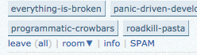
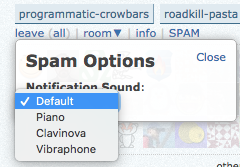

# SPAM
Smokey Pings After Message (SPAM) is used to play a sound when a smoke detector report turns up in either [Charocal-HQ](https://chat.stackexchange.com/rooms/11540/charcoal-hq) or [SOCVR](https://chat.stackoverflow.com/rooms/41570/so-close-vote-reviewers).

---
## How can I use SPAM?
Firstly, install the user script. Once you've done that, make sure you refresh the chatroom you are in. The script will now make a sound every time a smoke detector message turns up. By default it will make the 'ping' sound of the site you're on. 

## How can I change the sound?
Click the 'SPAM' link on the right hand side of the room (as depicted below):

Then select an item from the drop down menu:

## Something wrong?
Feel free to ping `@Henders` in CharcoalHQ.